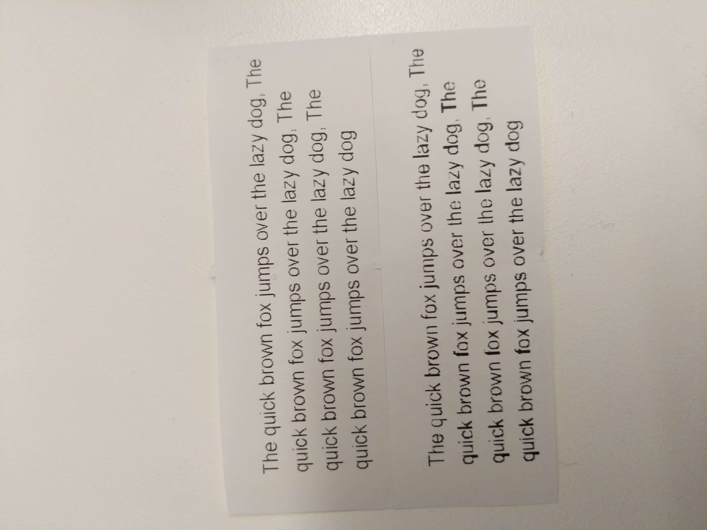

This shows the difference between printing with or without system dialog.

You can see it easily on vertical lines being heavier on the version printed without system dialog(silent print)

This stems from GdiTextPrinting not taking full effect despite being activated.

A probable solution is to patch chromium at https://github.com/chromium/chromium/blob/7178455852d5b340c815ce15ab2efcf277ed19e9/chrome/browser/printing/print_job.cc#L320 and remove the check for settings.print_text_with_gdi(), possibly only for windows platform